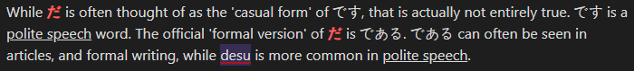
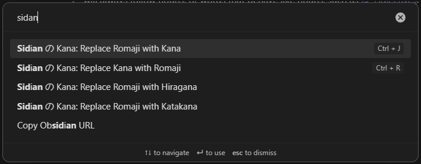
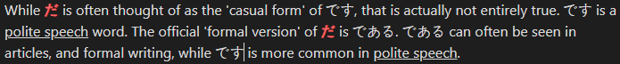

# Sidian の Kana

**Sidian の Kana** is a plugin for [Obsidian](https://obsidian.md) that enables seamless conversion of text between different Japanese scripts (Kana, Hiragana, Katakana, and Romaji) directly within your markdown files. Ideal for learners and writing their notes in English and Japanese, this plugin simplifies text transformation using functions that can be attached to hotkeys for a smooth experience.

---

## Features

-   **Text Conversion:** Convert selected text between:
    -   **Kana**: Converts Romaji to Kana (Hiragana + Katakana).
    -   **Hiragana**: Converts Romaji to Hiragana.
    -   **Katakana**: Converts Romaji to Katakana.
    -   **Romaji**: Converts Kana back to Romaji.
-   **Customizable Hotkeys:** There are no pre-configured hotkeys
-   **Settings Tab:** interface to access resources and support.
-   **Open Source:** Freely available for feature requests and contributions.
-   **IMPORTANT:** this plugin does not convert to/from _kanji_.

---

## Usage

1. Highlight the text you want to convert in the editor.
2. Press `Ctrl + P` to open the command palette.
3. Search for **Sidian No Kana** functions.
4. Select the appropriate function.
5. Your romaji now has turned into the corresponding characters.

Recommended:
1. Assign an hotkey for each function in obsidian settings.
2. Highlight the text you want to convert and press the hotkey.
3. Your romaji now has turned into the corresponding characters.

*Step By Step Images:*


1. 

1. 

1. 

---

## Installation

### From Community Plugins

1. Open Obsidian.
2. Navigate to `Settings > Community Plugins > Browse`.
3. Search for **Sidian の Kana**.
4. Click "Install" and enable the plugin.

### Manual Installation

1. Download the latest release from the [GitHub Releases](https://github.com/ToniG22/sidian-no-kana/releases).
2. Copy `main.js`, `manifest.json`, and `styles.css` to your vault’s plugin folder:
    ```
    VaultFolder/.obsidian/plugins/sidian-no-kana/
    ```
3. Enable the plugin in `Settings > Community Plugins`.

---

## Settings

-   Open the settings tab for:
    -   Access to the [GitHub Repository](https://github.com/ToniG22/sidian-no-kana).
    -   Support the developer with a [donation](https://www.buymeacoffee.com/tonig22).

---

## Development

### Prerequisites

-   [Node.js](https://nodejs.org/) (v16 or higher).
-   Basic knowledge of TypeScript and the Obsidian plugin API.

### Quick Start

1. Clone the repository:
    ```bash
    git clone https://github.com/ToniG22/sidian-no-kana.git
    ```
2. Install dependencies:
    ```bash
    npm install
    ```
3. Start development mode:
    ```bash
    npm run dev
    ```
4. Place the compiled files in your vault’s plugin folder:
    ```
    VaultFolder/.obsidian/plugins/sidian-no-kana/
    ```
5. Reload Obsidian to test your changes.

---

## Contributing

Contributions are welcome! Whether it’s a bug fix, new feature, or documentation improvement:

1. Fork the repository.
2. Create a new branch.
3. Submit a pull request.

---

## Support

If you find this plugin helpful, consider supporting its development:

-   [Buy Me a Coffee](https://www.buymeacoffee.com/tonig22).
-   Share the plugin with others!

For feature requests or issues, visit the [GitHub Issues Page](https://github.com/ToniG22/sidian-no-kana/issues).

---

## License

This plugin is open-source software licensed under the [MIT License](https://opensource.org/licenses/MIT).

---

## Acknowledgments

-   [Wanakana.js](https://github.com/WaniKani/WanaKana): For handling Japanese text conversion.
-   The Obsidian Community: For creating such a versatile platform.
